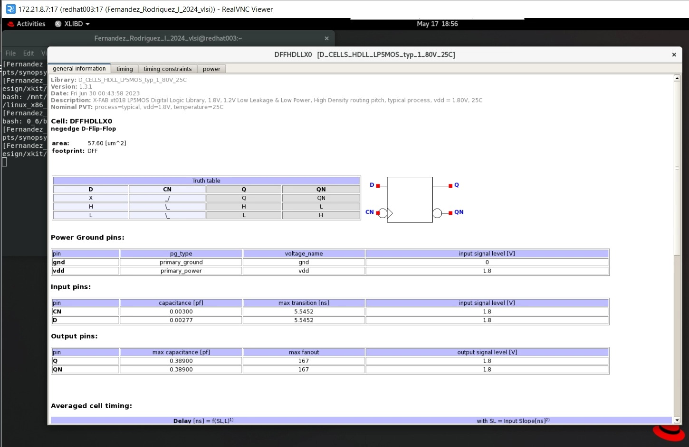
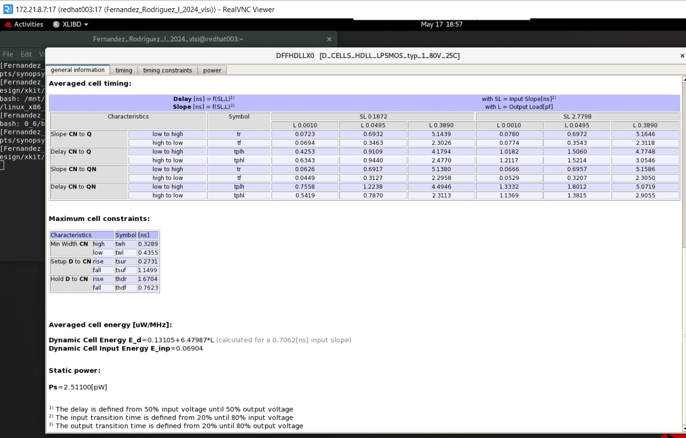
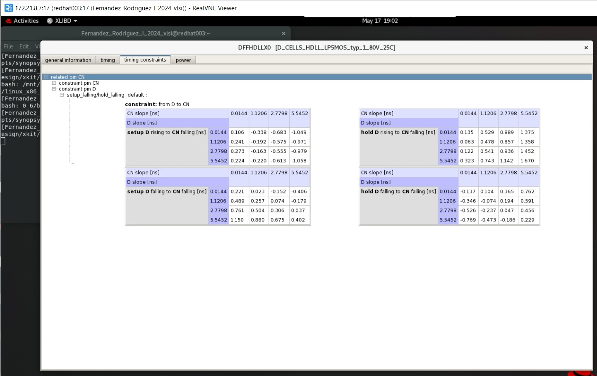

# Tarea_3_VLSI

## Introducción
En este repositorio se mostrará el proceso para obtener los tiempos de hold y de setup de forma simulada de un Flip Flop estático Amo-Esclavo de un bit, para despueés compararlos con los valores teóricos obtenidos con la herramienta LibertyDisplayer. Esto permite realizar una comparación con la realidad de cómo cambian los tiempos entre la teoría y la realidad. Para obtener un resultado más realista se incluyó un par de inversores para simular la pendiente de la entrada al flip flop de clk.

## Datos Relevantes
* La simulación usará la técnica de variación de tcd y medición de tpcq
* La tecnología a utilizar será XFAB 0.18µm (Bulk CMOS XH018)
* Se utilizará el Flip Flop de la librería D_CELLS_HDLL, donde la celda es la DFFHDLLX0
  
## Resultados

Los datos teóricos obtenidos mediante la herramienta LibertyDisplayer se muestran a continuación:

Se montó el deck de SPICE con los inversores y el flip-flop para medir los tiempos de setup y de hold, la gráfica obtenida se muestra a continuación:

Y los resultados de la simulación se encuentran resumidos a continuación:

## Análisis

